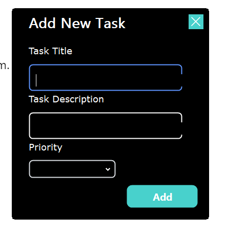

# To-Do List Application

This project is a To-Do List application developed in C#. The application allows users to manage tasks by adding, viewing, and marking them as completed. It also includes features for setting task priorities and organizing tasks effectively.

## Features

- **Add New Tasks**: Users can add new tasks with a title, description, and priority level (e.g., high, medium, low).
- **View Tasks**: Tasks are displayed in a list format, with color-coded priority indicators.
- **Manage Tasks**: Users can mark tasks as completed or delete tasks that are no longer needed.
- **Priority Levels**: Tasks can be categorized by priority to help users focus on the most important items first.

## Screenshots

### Main To-Do List Interface



*Description*: The main interface shows the list of tasks, with options to mark them as completed or delete them. Tasks are color-coded based on priority.

### Add New Task Interface


*Description*: This interface allows users to add new tasks by entering a title, description, and selecting the priority level.

## Technologies Used

- **C#**
- **.NET Framework**
  
## How to Run

1. Clone the repository:
   ```bash
   git clone https://github.com/yourusername/todo-list-app.git
